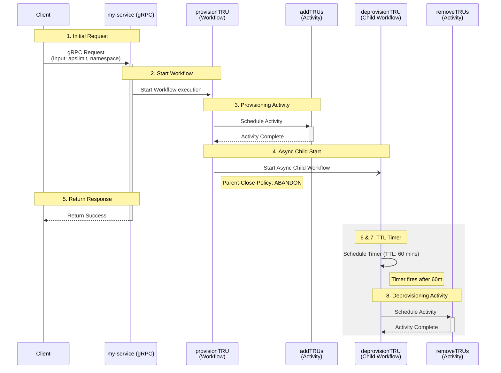

# Orchestrate Temporary Rate Limit Increases on Temporal Cloud Namespaces
This pattern provides the steps to dynamically provision and automatically deprovision capacity on Temporal Cloud.

Applications often experience predictable or temporary spikes in throughput that require additional Temporal Cloud 
capacity. This pattern demonstrates how to grant time-limited increases to your capacity limits and guarantee that 
those resources are released after a specific duration.

Permanently allocating peak capacity requirements for a namespace results in unnecessary costs. However, manually 
adjusting capacity quotas before and after load spikes is prone to human error, risking either workflow throttling if 
limits are not raised in time, or runaway costs if operators forget to reduce limits after the workload subsides.

A parent Workflow (capacity/provision_workflow.go) executes an Activity (capacity/activities.go) to raise the 
capacity limit, then starts an asynchronous Child Workflow configured with an abandon policy 
(capacity/deprovision_worfklow.go). The parent Workflow completes to unblock the client, while the Child Workflow waits 
for a designated duration before executing an Activity to revert the capacity to its original limit.

## Architecture Diagram


1. A client application sends a gRPC request to the `my-service` application with the requested limit and namespace.
2. The `my-service` application uses the Temporal SDK client to start the `provisionTRU` Workflow.
3. The `provisionTRU` Workflow schedules the `addTRUs` Activity and waits for it to complete.
4. The `provisionTRU` Workflow starts the `deprovisionTRU` asynchronous Child Workflow using a parent close policy of abandon.
5. The `provisionTRU` Workflow completes, and `my-service` returns a success response to the client.
6. The `deprovisionTRU` Child Workflow sets a Timer for 60 minutes.
7. The Timer fires after the TTL expires.
8. The `deprovisionTRU` Child Workflow schedules the `removeTRUs` Activity to revert the capacity limits.

## Running the sample
You will need a Temporal Cloud namespace using on-demand capacity to test against and a Temporal Cloud API key with 
access permissions to modify that namespace.

### Start a local Temporal server
```bash
temporal server start-dev
```
This server is used to run the workflows locally.

### Start the worker
```bash
export TEMPORAL_CLOUD_API_KEY="..."
go run cmd/worker/main.go
```

### Start the provisioning workflow
```bash
export TEMPORAL_CLOUD_NAMESPACE="..."
go run cmd/trigger/main.go
```
You should observe the change in capacity to 1000 APS provisioned capacity in the Temporal Cloud UI. After 5 minutes 
this should revert to on-demand capacity.